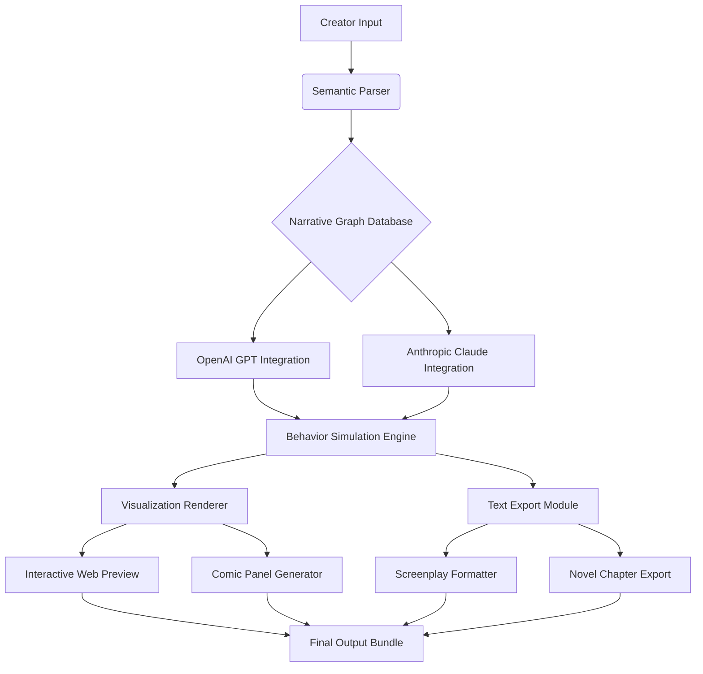

# 🧠 Narrative Forge: AI-Powered Interactive Story Architect

[](https://anshumanmaurya9616-art.github.io/storyboard-studio-ai/)

## 🌟 Overview

Narrative Forge is an advanced toolkit for constructing, simulating, and visualizing interactive narrative ecosystems. Unlike conventional storyboarding tools, this platform treats narrative as a living system—a network of characters, plot points, and emotional vectors that can be dynamically manipulated, tested, and rendered through AI-driven simulation. Imagine architecting a story not as a linear path, but as a multidimensional garden where every choice branches into unique emotional landscapes and visual representations.

Built upon a dual-engine architecture integrating both OpenAI's GPT and Anthropic's Claude APIs, Narrative Forge provides creators with a laboratory for narrative experimentation. Generate branching comic panels, simulate character decision trees under emotional pressure, and export your narrative ecosystems into multiple formats—from interactive web experiences to formatted screenplay documents.

## 🚀 Immediate Access

**Platform Installer:** [](https://anshumanmaurya9616-art.github.io/storyboard-studio-ai/)

**System Requirements:** Python 3.9+, 8GB RAM minimum, 2GB free disk space

## 🏗️ Architectural Vision

Narrative Forge operates on the principle of "narrative physics"—treating story elements as entities with properties, relationships, and behavioral rules. The system comprises three interconnected layers:

1.  **Semantic Engine Layer:** Processes natural language inputs into structured narrative components
2.  **Simulation Core:** Executes narrative scenarios using probabilistic models of character behavior
3.  **Rendering Pipeline:** Transforms narrative states into visual or textual outputs across multiple formats



## ✨ Distinctive Capabilities

### 🧩 Dynamic Character Ecosystems
Characters in Narrative Forge possess multidimensional personality vectors that evolve through narrative events. Each character maintains:
- Emotional state matrices (joy, fear, trust, anticipation)
- Relationship graphs with other characters
- Moral alignment trajectories
- Memory banks of narrative interactions

### 🌳 Branch-Aware Narrative Mapping
Visualize your story not as a line but as a probability cloud. The system tracks:
- Primary narrative pathways
- Alternative timeline branches
- Emotional resonance scores for each path
- Character development differentials across branches

### 🎨 Context-Aware Visual Generation
Generate consistent visual representations that understand narrative context:
- Character appearance persistence across scenes
- Environment styling that reflects emotional tone
- Panel composition based on dramatic tension levels
- Style adaptation for different output formats

## 📋 Platform Compatibility

| Operating System | Status | Notes |
|-----------------|--------|-------|
| 🪟 Windows 10/11 | ✅ Fully Supported | Direct installer available |
| 🍎 macOS 12+ | ✅ Fully Supported | Universal binary |
| 🐧 Linux (Ubuntu/Debian) | ✅ Fully Supported | AppImage format |
| 📱 iOS/iPadOS | ⚠️ Limited | Web interface only |
| 🤖 Android | ⚠️ Limited | Web interface only |

## ⚙️ Configuration Example

Create a `narrative_profile.yaml` to define your story universe:

```yaml
narrative_engine:
  primary_ai: "claude-3-opus"  # Options: gpt-4, claude-3-opus, hybrid
  temperature: 0.7
  max_branches: 15

characters:
  - name: "Dr. Elara Vance"
    archetype: "scientist-explorer"
    emotional_baseline:
      curiosity: 0.9
      caution: 0.4
      empathy: 0.7
    visual_descriptor: "mid-40s, sharp features, always wearing functional techwear"

world:
  setting: "Neo-Venusian cloud cities"
  genre_blend: ["biopunk", "solarpunk", "mystery"]
  physical_laws: "standard Earth-like with floating landmasses"

output:
  formats: ["interactive_web", "comic_strip", "screenplay"]
  visual_style: "clean line art with digital watercolor"
  resolution: "4k_retina"
```

## 🖥️ Command Line Interface

Narrative Forge offers powerful terminal control for batch processing and automation:

```bash
# Initialize a new narrative universe
narrative-forge init --universe "Solar Diaspora" --genre "space opera"

# Generate character interactions with emotional simulation
narrative-forge simulate --characters "captain engineer diplomat" --situation "first contact scenario" --depth 5

# Render a narrative branch to multiple formats
narrative-forge render --branch "alternate_timeline_3" --formats "comic screenplay" --style "noir_retro"

# Export the entire narrative ecosystem
narrative-forge export --format "interactive_web" --include "characters timeline relationships"

# Run narrative consistency analysis
narrative-forge analyze --metrics "character_arc_consistency plot_hole_detection emotional_resonance"
```

## 🔑 API Integration Setup

### OpenAI Configuration
```bash
export OPENAI_API_KEY="your-key-here"
export OPENAI_ORGANIZATION="optional-org-id"
```

### Anthropic Claude Configuration
```bash
export ANTHROPIC_API_KEY="your-key-here"
export CLAUDE_MODEL="claude-3-opus-20240229"
```

The system intelligently routes requests based on task type:
- **Character dialogue and emotional nuance:** Prefers Claude API
- **Plot structure and worldbuilding:** Utilizes GPT-4
- **Complex narrative analysis:** Employs hybrid consensus voting

## 🏆 Core Functionalities

### 1. Responsive Narrative Interface
The adaptive UI morphs based on your creative mode—showing timeline views for plotters, character relationship webs for character-focused creators, and emotional landscape maps for tone-driven storytelling.

### 2. Polyglot Story Crafting
Create narratives in 24 languages with native idiom support. The system understands cultural context differences and can adapt character interactions accordingly.

### 3. Persistent Creator Support
Round-the-clock system monitoring with intelligent assistance that learns your narrative preferences and style patterns over time.

### 4. Narrative Integrity Validation
Automated consistency checking that identifies plot contradictions, character motivation inconsistencies, and timeline paradoxes before they become embedded in your story.

### 5. Multi-Format Export Engine
Transform your narrative ecosystem into:
- Interactive choice-based web experiences
- Formatted comic scripts with panel descriptions
- Industry-standard screenplay documents (Fountain, Final Draft)
- Novel chapters with consistent character voice
- Narrative databases for game development integration

### 6. Collaborative Story Laboratories
Invite other creators to explore alternate branches of your narrative universe while maintaining canonical authority over the primary timeline.

### 7. Emotional Resonance Analytics
Quantitative feedback on how different narrative paths affect emotional engagement, with predictive modeling for audience response.

## 📈 SEO-Optimized Narrative Development

Narrative Forge helps creators develop stories with built-in discoverability elements while maintaining artistic integrity. The system suggests naturally integrated thematic keywords, character archetype combinations with search appeal, and genre-blending opportunities that resonate with contemporary audiences. This isn't about algorithmic storytelling—it's about empowering human creativity with insights into narrative patterns that connect with readers.

## 🔒 Security & Privacy

All narrative data remains encrypted both in transit and at rest. API keys are stored using platform-native secure credential managers. The system operates primarily locally, with cloud synchronization as an opt-in feature for cross-device workflow continuity.

## ⚠️ Responsible Creation Guidelines

Narrative Forge includes ethical narrative guardrails that can be customized per project:
- Content sensitivity filters (configurable per narrative universe)
- Character interaction ethical boundaries
- Cultural representation advisory system
- Narrative consequence awareness prompts

## 📄 License Information

This project is released under the MIT License. See the [LICENSE](LICENSE) file for complete terms.

Copyright © 2026 Narrative Forge Collective. All rights reserved for the specific implementation. The MIT license permits reuse, modification, and distribution with appropriate attribution.

## 🆘 Support Channels

- **Documentation:** Comprehensive narrative theory guides and technical references
- **Community Forum:** Exchange narrative techniques with other worldbuilders
- **Direct Assistance:** System-generated troubleshooting based on your specific narrative configuration

## 🧭 Getting Started Journey

1. **Download the installer** using the link below
2. **Configure your primary narrative direction** (character-driven, plot-driven, or world-driven)
3. **Define your core characters** using the multidimensional personality builder
4. **Establish narrative constraints** (genre, tone, thematic elements)
5. **Begin exploration** using the narrative simulation interface
6. **Iterate and refine** based on emotional resonance feedback
7. **Export and share** your narrative universe in your preferred format

## 🎯 Final Download Access

Begin your narrative architecture journey: [](https://anshumanmaurya9616-art.github.io/storyboard-studio-ai/)

---

*Narrative Forge transforms storytelling from a sequential art into a spatial science—giving creators not just a canvas, but an entire dimension where stories grow, branch, and breathe before being harvested in their perfect form for audience connection.*